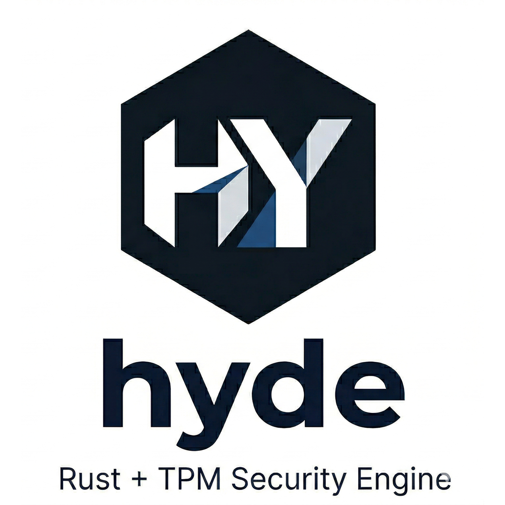

<div align="center">



# hyde

Unified abstraction layer for hardware-based Trusted Execution Environments (TEE) in Rust.

ハードウェアTEEの統一抽象化レイヤー（Rust）

[](https://opensource.org/licenses/MIT)
[](https://www.rust-lang.org)

</div>

---

## Why hyde? / なぜhydeが必要か

Data has three states. Two are solved. One is not.

データには3つの状態がある。2つは解決済み。1つは未解決。

| State / 状態 | Threat / 脅威 | Solution / 解決策 |
|---|---|---|
| At rest / 保存時 | Disk theft | BitLocker / FileVault |
| In transit / 通信時 | Interception | HTTPS / TLS |
| In use / 実行時（物理） | Memory sniff, SPI bus attack | **hyde Phase 1 (TPM)** |
| In use / 実行時（クラウド） | Cloud admin, hypervisor | **hyde Phase 2 (TDX/SEV-SNP)** |
| In use / 実行時（AI） | Model theft, prompt leak | **hyde Phase 4 (H100 CC)** |

hyde binds secrets to **a specific device + a specific person** using TPM (Trusted Platform Module). Even if stored in the cloud, data cannot be decrypted without that person and that device.

hydeはTPMを使い、秘密情報を「特定のデバイス＋特定の人物」に紐付けて保護する。クラウドに保存されても、その人物・そのデバイスなしには復号できない。

### Protection scope by phase / フェーズ別の守備範囲

| Phase | Technology | Disk theft / ディスク盗難 | Boot tampering / ブート改ざん | Admin key extraction / 管理者による鍵取り出し | Runtime memory access / 実行時メモリアクセス |
|-------|-----------|:-:|:-:|:-:|:-:|
| **1 (current)** | TPM 2.0 + PQC | ✅ | ✅ | ✅ FixedTPM refuses | ❌ Keys in RAM during operation |
| **2 (planned)** | Intel TDX / AMD SEV-SNP | ✅ | ✅ | ✅ FixedTPM refuses | ✅ Hardware memory encryption |

Phase 1 protects **data at rest** (disk theft, boot integrity) and **data in transit** (PQC encryption). Sealed keys are created with `FixedTPM=true`, meaning **admin privileges cannot extract keys** — the TPM refuses by design. An admin can disable the TPM, stop the hyde process, delete encrypted files, or prevent new encryption (operational disruption), but **cannot decrypt existing protected data**. Protection against **cloud admin runtime memory access** (reading keys from RAM while hyde is running) requires Phase 2's hardware memory encryption (TDX/SEV-SNP).

Phase 1は**保存時**（ディスク盗難・ブート整合性）と**通信時**（PQC暗号化）を保護する。シールされた鍵は`FixedTPM=true`で生成されるため、**管理者権限でも鍵の取り出しは不可能** — TPMが設計上拒否する。管理者はTPMの無効化、hydeプロセスの停止、暗号化ファイルの削除、新規暗号化の妨害は可能（運用妨害）だが、**既存の暗号化データの復号はできない**。**クラウド管理者による実行時メモリアクセス**（hyde実行中にRAMから鍵を読み取る攻撃）の防御にはPhase 2のハードウェアメモリ暗号化（TDX/SEV-SNP）が必要。

---

## Design Philosophy / 設計思想

hyde's trust model is **one person, multiple TPMs, distributed keys**.

hydeの信頼モデルは**1人が複数のTPMを持ち、鍵を分散する**。

Data is copied everywhere — cloud, USB, every PC. It doesn't matter, because it's all ciphertext. **Keys are the only thing that matters**, and they are locked inside TPMs that are physically distributed (e.g., Tokyo and Osaka) and normally offline. Decryption requires multiple TPMs to cooperate.

データはどこにでもコピーする — クラウド、USB、各PC。暗号文なので問題ない。**守るべきは鍵だけ**であり、鍵は物理的に離れた場所（例：東京と大阪）のTPMに分散され、普段はオフライン。復号には複数のTPMの協力が必要。

Multi-user operating systems introduced the concept of "admin privileges." hyde renders this irrelevant: **FixedTPM blocks data theft**, and **redundant copies neutralize operational disruption**. An admin with root access on one device cannot steal data (TPM refuses) and cannot destroy it (copies exist elsewhere). The more copies, the more resilient the system becomes.

マルチユーザーOSは「管理者権限」という概念を生み出した。hydeはこれを無意味にする：**FixedTPMが情報窃取を阻止**し、**コピーの冗長性が運用妨害を無力化**する。1台のデバイスでroot権限を持つ管理者がいても、データは盗めない（TPMが拒否）し、消しても無駄（他にコピーがある）。コピーが増えるほどシステムは強靭になる。

hyde addresses infrastructure reality in phases:

hydeはインフラの現実にフェーズで対応する：

| Phase | Approach / アプローチ |
|---|---|
| **Phase 1 (current)** | TPM-distributed keys + offline devices. Security = FixedTPM + zeroize + mlock / TPM分散鍵 + オフラインデバイス |
| **Phase 2 (planned)** | TDX/SEV-SNP adds runtime memory protection on shared infrastructure / 共有インフラ上でもランタイムメモリ保護を追加 |

The core design insight: **"There is no perfect safety. Minimize and push the trust boundary to the edge."**

設計思想の核心：**「完全な安全はない。信頼が必要な範囲を、できる限り小さく・末端にする。」**

---

## Post-Quantum Cryptography (PQC) / ポスト量子暗号

hyde v0.2+ protects all data with **ML-KEM-768** (NIST FIPS 203) post-quantum encryption, always-on by default.

hyde v0.2+は、全データを **ML-KEM-768**（NIST FIPS 203）ポスト量子暗号で保護する。常時有効、デフォルトで最強。

### Why PQC matters / なぜPQCが必要か

**HNDL (Harvest Now, Decrypt Later)** — adversaries capture encrypted data today, decrypt it with quantum computers in the future. For long-lived secrets (medical records, classified documents), this is a real threat.

**HNDL（今収穫、後で復号）** — 暗号化データを今収集し、将来量子コンピュータで解読する攻撃。医療記録や機密文書など長期保存データには現実的な脅威。

### Two-layer architecture / 二層アーキテクチャ

```
┌─────────────────────────────────────────────────┐
│  Layer 2: TPM Seal (device-binding)             │
│  AES-256-GCM with TPM-wrapped Data Key          │
│                                                 │
│  ┌─────────────────────────────────────────────┐│
│  │  Layer 1: PQC Encryption (chip-independent) ││
│  │  ML-KEM-768 + AES-256-GCM                   ││
│  │  Quantum-resistant, portable                 ││
│  └─────────────────────────────────────────────┘│
└─────────────────────────────────────────────────┘
```

- **Layer 1 (PQC)**: Quantum-resistant encryption. Chip-independent — survives hardware migration.
- **Layer 2 (TPM)**: Device-binding. Only this TPM can unseal.
- **Migration**: Only the PQC key needs to be migrated. No re-encryption of data.

開発者はセキュリティレベルを選ぶ必要なし。`ctx.protect()` でリモート攻撃・HNDL脅威に対して最強の暗号化が自動的に適用される。

---

## The Hyde Ecosystem / Hydeエコシステム

hyde is the foundation of a three-module cryptographic ecosystem:

hydeは3モジュールの暗号エコシステムの基盤：

<div align="center">

| Module | Technology | Purpose / 用途 |
|--------|-----------|----------------|
| **[hyde](https://gitlab.com/Ryujiyasu/hyde)** | TPM + PQC (ML-KEM) | **Protect** data — encrypt, device-bind, quantum-resistant / データを守る |
| **[argo](https://gitlab.com/Ryujiyasu/argo)** | ZKP (Zero-Knowledge Proofs) | **Prove** statements without revealing data / データを見せずに証明する |
| **[plat](https://gitlab.com/Ryujiyasu/plat)** | FHE / GPU TEE (H100) | **Compute** on encrypted data / 暗号化したまま計算する |

</div>

```
 Protect          Prove           Compute
┌─────────┐    ┌─────────┐    ┌─────────┐
│  hyde    │───▶│  argo   │───▶│  plat   │
│ TPM+PQC │    │  ZKP    │    │FHE/H100 │
└─────────┘    └─────────┘    └─────────┘
  守る            証明する        計算する
```

All modules share hyde's TPM trust chain as the key management foundation.

全モジュールがhydeのTPM信頼チェーンを鍵管理の基盤として共有。

### Each Module's Limits / 各モジュールの限界

These limits are not defects — they are fundamental constraints that no cryptographic technology can transcend.

これらの限界は欠陥ではなく、どんな暗号技術も超えられない本質的な制約である。

| Module | Limit / 限界 | Mitigation / 補完 |
|---|---|---|
| **hyde** | Data theft impossible (FixedTPM). Operational disruption neutralized by redundant copies across devices / 情報窃取は不可能（FixedTPM）。運用妨害もコピーの冗長性で無力化 | Phase 2 (TDX/SEV-SNP) for runtime memory protection |
| **plat** | Cannot guarantee input authenticity / 入力の真正性は保証できない | IoT + TPM (hyde) |
| **argo** | Cannot prove correspondence with physical reality / 現実世界との一致は証明できない | Oracle problem — fundamental |

### The Vision / ビジョン

Together, these three modules enable a world where **social trust can be established without ever exposing data**.

3つのモジュールが揃うことで、**データを一切公開せずに社会的な信頼を構築できる**世界を実現する。

```
Example: Medical AI diagnosis without exposing patient data
例：患者データを公開せずに医療AI診断

hyde: Encrypt genome data, bind to patient's device
      遺伝子データを暗号化・患者のデバイスに紐付け

plat: AI diagnoses on encrypted data — never sees raw genome
      暗号化したままAIが診断 — 生の遺伝子データは見えない

argo: Prove "low cancer risk" to insurer — without revealing score
      保険会社に「癌リスク低」を証明 — スコアは見せない
```

### The Endgame: Physical-to-Blockchain Bridge / 完成形：物理とブロックチェーンの接続

**"A bridge that connects physical-world trust to the digital world."**

**「物理世界の信頼をデジタル世界に接続する橋」**

```
TPM chip (physical — EK burned at manufacture)
TPMチップ（物理・製造時にEK焼き付け）
  ↓ Hardware signature / ハードウェア署名
Data, photos, CO2 emissions (digital)
データ・写真・CO2排出量（デジタル）
  ↓ argo (ZKP) proves facts / argoで証明
Blockchain (immutable permanent record)
ブロックチェーン（改ざん不可能な永続記録）
```

**Applications / 応用**:
- CO2 emissions: privacy-preserving computation (Scope 3 calculation) / CO2排出量の秘匿計算（Scope3算定）
- Photo authenticity: cryptographic proof (C2PA alternative) / 写真の真正性証明（C2PA代替）
- Medical records: patient-sovereign management / 医療カルテの患者主体管理
- Vehicle data × taxation: privacy-preserving compliance / 自動車走行データ × 税制
- Age verification: zero-knowledge proof / 年齢確認の秘匿証明

**"Mathematically proven digital society infrastructure where no one needs to be trusted."**

**「誰も信頼しなくていい、数学的に証明されたデジタル社会のインフラ」**

```
hyde → Protect (TPM + PQC)     — No one can read your data
       守る                     — 誰もデータを読めない

argo → Prove (ZKP)             — No one needs to see your data
       証明する                 — 誰もデータを見る必要がない

plat → Compute (FHE / H100)    — No one touches your data
       計算する                 — 誰もデータに触れない
```

The logical conclusion of this philosophy: an operating system built from the ground up around hyde's trust model — **hydeOS**. Not a feature request, but an inevitability. When every layer from boot to application assumes "one person, one device, trust only physics and math," the OS itself must be redesigned.

この思想の論理的帰結：hydeの信頼モデルを前提にゼロから構築されたOS — **hydeOS**。機能要望ではなく必然。ブートからアプリケーションまで全レイヤーが「1人1デバイス、信じるのは物理と数学だけ」を前提とするなら、OS自体を再設計するしかない。

---

## Positioning: hyde vs BitLocker / ポジショニング

hyde is **not** a BitLocker replacement. They are not even comparable — they solve fundamentally different problems.

hydeはBitLockerの**代替ではない**。比較対象ですらない — 解く問題が根本的に異なる。

| | BitLocker | hyde |
|---|---|---|
| **What it protects** / 何を守るか | Entire volume / ディスク全体 | Application data, per object / アプリデータ、オブジェクト単位 |
| **Encryption** / 暗号化 | AES (classical) | ML-KEM-768 + AES-256-GCM (post-quantum) |
| **API** | None (OS-level) | `ctx.protect(secret)?` — one line |
| **Platform** | Windows only | Linux, Windows (Phase 3: macOS, mobile) |
| **Granularity** / 粒度 | Volume-level | Per `protect()` call |
| **Quantum resistant** / 耐量子 | ❌ | ✅ NIST FIPS 203 |
| Admin escalation / 管理者権限奪取 | ❌ Out of scope | ✅ Data theft blocked (FixedTPM) + disruption neutralized (redundant copies) / 情報窃取はFixedTPMが拒否 + 運用妨害はコピー冗長性で無力化 |
| Physical attacks / 物理攻撃 | ❌ Out of scope | ❌ Out of scope (vendor) |

**Key difference from BitLocker:** hyde's FixedTPM flag means that even with admin privileges, the sealed keys cannot be extracted from the TPM — **data theft is impossible**. Operational disruption (file deletion, TPM disable) is neutralized by redundant encrypted copies across multiple devices and clouds. The more copies, the more resilient. Phase 2 (TDX/SEV-SNP) adds runtime memory protection.

**BitLockerとの重要な違い:** hydeのFixedTPMフラグにより、管理者権限があってもTPMから鍵を取り出すことは不可能 — **情報窃取は不可能**。運用妨害（ファイル削除・TPM無効化）は、複数デバイス・クラウドへの暗号化コピーの冗長性で無力化される。コピーが増えるほどシステムは強靭になる。Phase 2（TDX/SEV-SNP）ではランタイムメモリ保護を追加する。

---

## Quick Start / クイックスタート

```rust
use hyde::{self, FallbackPolicy, PassphraseRecovery};

fn main() -> Result<(), Box<dyn std::error::Error>> {
    let mut ctx = hyde::auto_detect(FallbackPolicy::Deny)?;

    // Protect data (ML-KEM-768 PQC + TPM AES-256-GCM — always both layers)
    let secret = b"my document encryption key";
    let protected = ctx.protect(secret)?;

    // Serialize and save anywhere (disk, S3, cloud — HNDL-resistant)
    let json = serde_json::to_string(&protected)?;

    // Decrypt (requires the same TPM + PQC key)
    let deserialized: hyde::ProtectedData = serde_json::from_str(&json)?;
    let recovered = ctx.unprotect(&deserialized)?;
    assert_eq!(recovered, secret);

    // Passphrase backup (for device migration / TPM failure)
    let strategy = PassphraseRecovery;
    let bundle = ctx.backup(&protected, &strategy, Some(b"my-recovery-passphrase"))?;
    let restored = ctx.restore(&bundle, &protected.ciphertext, &strategy, b"my-recovery-passphrase")?;

    Ok(())
}
```

## Architecture / アーキテクチャ

```
┌─────────────────────────────────┐
│       Application               │
│  hyde::auto_detect()            │
│  ctx.protect() / unprotect()    │
└────────────┬────────────────────┘
             │
┌────────────▼────────────────────┐
│  hyde (facade crate)            │
│  Auto-detects best backend      │
└────────────┬────────────────────┘
             │
┌────────────▼────────────────────┐
│  hyde-core                      │
│  TeeBackend trait               │
│  PQC layer (ML-KEM-768)         │
│  HydeContext, ProtectedData     │
└────────────┬────────────────────┘
             │
┌────────────▼──────────────────────────┐
│  Backend crates                       │
│  ┌──────────┐  ┌──────────────────┐   │
│  │ hyde-tpm │  │ hyde-software    │   │
│  │ (TPM 2.0)│  │ (fallback stub)  │   │
│  └──────────┘  └──────────────────┘   │
│  ┌────────────────────────────────┐   │
│  │ Phase 2+: hyde-tdx, hyde-sev  │   │
│  └────────────────────────────────┘   │
└───────────────────────────────────────┘
```

## Key Design: Primary Key + Data Key / 鍵管理の設計

hyde learns from **20 years of BitLocker history** — the most battle-tested full-disk encryption in production. We studied its architecture, key hierarchy, recovery mechanisms, and the real-world failures it solved, then built a modern equivalent for the TEE era.

hydeは**BitLockerの20年の歴史**から学んでいる。プロダクション環境で最も実戦検証されたフルディスク暗号化の設計思想・鍵階層・回復メカニズム・実運用で解決してきた障害を研究し、TEE時代の現代版として再構築した。

hyde uses the **BitLocker pattern** to avoid TPM NV memory exhaustion:

hydeはBitLockerパターンを採用し、TPMのNVメモリ枯渇を防ぐ：

1. **Primary Key** (1 per device) — persisted in TPM NV memory (1 slot)
2. **Data Key** (1 per protect call) — generated by TPM RNG, sealed under Primary Key, stored as blob on disk
3. **PQC Layer** — ML-KEM-768 encapsulation per protect call, quantum-resistant AES-256-GCM encryption
4. **Encryption** — Data is double-encrypted: PQC (inner, chip-independent) + TPM (outer, device-bound)

### What hyde learned from BitLocker / BitLockerから学んだ設計パターン

| BitLocker Concept | hyde Equivalent | Why it matters / なぜ重要か |
|---|---|---|
| VMK → FVEK (2-layer key hierarchy) | dk → DataKey | Heavy key (dk) pays cost once; lightweight DataKey rotates per `protect()` call for Forward Secrecy at near-zero cost / 重い鍵は1回、軽い鍵で毎回Forward Secrecyをほぼゼロコストで実現 |
| Protector (TPM, RecoveryKey, Password) | `RecoveryStrategy` trait | Multiple protection methods guard the same master key — pluggable and extensible / 複数の保護手段で同一マスター鍵を守る。差し替え可能で拡張性あり |
| 1 NV slot for VMK | 1 NV slot for Primary Key | Unlimited data protected from a single TPM slot — no NV exhaustion / TPM 1スロットで無限のデータを保護。NV枯渇なし |
| VMK re-wrap on key rotation | `dk` re-seal on PQC chip migration | Only the master key is re-sealed; data is never re-encrypted / マスター鍵のre-sealだけ。データの再暗号化は不要 |

This design ensures that when dedicated PQC hardware chips arrive, migration is a single re-seal operation — not a re-encryption of all data.

この設計により、将来PQC専用チップが登場した際の移行は、dk の re-seal 1回で完了する。全データの再暗号化は不要。

## Security Model / セキュリティモデル

### Trust Boundary / 信頼境界：ソフトウェアでできることの限界

**hyde trusts only what humans cannot alter: physics and mathematics.**

**hydeが信じるのは、人間が変えられないものだけ — 物理と数学。**

Physical laws cannot be rewritten remotely. Mathematical proofs cannot be negotiated down. Everything else — admin privileges, policies, goodwill — hyde eliminates structurally.

物理法則は遠隔で書き換えられない。数学的証明は交渉で下げられない。それ以外の全て — 管理者権限、ポリシー、善意 — hydeは構造で排除する。

| Layer / レイヤー | Trust / 信頼 | Responsibility / 責任 | Approach / 手段 |
|---|---|---|---|
| Physical chip (TPM, ATECC608) | **Trust** | Chip vendor | Out of scope — hardware tamper resistance |
| OS / Firmware | **Don't trust** | hyde | PCR measurement and verification |
| Cloud provider | **Don't trust** | hyde | Encryption excludes access |
| Admin privileges | **Don't trust** | hyde | Structural exclusion |
| Humans (including witnesses) | **Don't trust** | hyde | N-of-M + audit logs |
| Coercion | **Can't solve with tech** | Policy | Zero Negotiation Principle |

What hyde can do, hyde does. What hyde can't do, hyde says so honestly. A project that states what it **cannot** protect is one whose claims about what it **can** protect are credible.

できることはやる。できないことはできないと言う。「何を守れないか」を明言するプロジェクトは、「何を守れるか」の部分が信用できる。

### Scope / 守備範囲

**hyde is not a security tool. hyde is privacy infrastructure.**

**hydeはセキュリティツールではない。プライバシーインフラである。**

The question hyde answers is not "can bad actors get in?" (security), but **"can even authorized parties see the data?"** (privacy). Security improvements are a side effect.

hydeが解く問いは「悪い人が入ってこれないか」（セキュリティ）ではなく、**「正規のアクセス権者を含む第三者にも見せない」**（プライバシー）。セキュリティの向上はその副産物である。

**Data sovereignty through responsibility**:

**責任によるデータ主権**：

- If encrypted data leaks → data is still protected (hyde's guarantee) / 暗号化データが漏洩 → データは守られる（hydeの保証）
- If the key (TPM) is stolen → device owner's responsibility / 鍵（TPM）が盗まれた場合 → デバイス所有者の責任
- This is what it means to return data sovereignty to the user / これがデータの主体権をユーザーに返すことの意味

hyde's threat model distinguishes between **data theft** (extracting keys/data) and **denial of service** (disrupting operations):

hydeの脅威モデルは**データ窃取**（鍵やデータの抜き取り）と**サービス妨害**（運用の妨害）を区別する：

| Threat / 脅威 | Data theft / 情報窃取 | Operational disruption / 運用妨害 | Phase 2 improvement |
|---|---|---|---|
| Admin privilege escalation / 管理者権限奪取 | ✅ **Blocked** — FixedTPM refuses key extraction / FixedTPMが鍵取り出しを拒否 | ✅ **Neutralized** — redundant copies across devices / コピー冗長性で無力化 | Runtime memory protection (TDX/SEV-SNP) |
| Physical attacks (SPI sniffing) / 物理攻撃 | Out of scope | Out of scope | Chip vendor responsibility |
| Cloud admin memory access / クラウド管理者 | ⚠ Phase 1 risk — keys in RAM during operation | ⚠ Possible | **In scope** — hardware memory encryption |

**Critical distinction:** In Phase 1, an admin who gains root access **cannot extract sealed keys** from the TPM (FixedTPM flag). They can disable the TPM, stop the hyde process, or delete encrypted files (operational disruption), but **existing encrypted data remains undecryptable**. To mitigate operational disruption, hyde recommends backing up protected data to a second device with its own TPM. This is stronger than "out of scope" — data theft is actively defended by hardware.

**重要な区別:** Phase 1において、root権限を取得した管理者でも**TPMから鍵を取り出すことはできない**（FixedTPMフラグ）。TPMの無効化、hydeプロセスの停止、暗号化ファイルの削除は可能（運用妨害）だが、**既存の暗号化データは復号不可能のまま**。運用妨害への対策として、別TPMを持つ2台目のデバイスへのバックアップを推奨する。これは「スコープ外」ではなく、情報窃取はハードウェアが能動的に防御している。

---

### Threat: SPI Bus Sniffing / 脅威: SPIバス盗聴

This is a **physical attack** — a logic analyzer is physically attached to the SPI bus between CPU and dTPM. By hyde's trust boundary, this is fundamentally a **chip vendor's responsibility** (unencrypted bus design). hyde provides software-side mitigation as defense-in-depth, not as a claim to solve a physical problem.

これは**物理攻撃**である — CPUとdTPM間のSPIバスにロジックアナライザを物理接続する。hydeの信頼境界に従えば、根本原因は**チップベンダーの責任**（バスの平文通信設計）。hydeはdefense-in-depthとしてソフト側の緩和策を提供するが、物理の問題を解決したとは主張しない。

```
Attack cost / 攻撃コスト: ~$300 logic analyzer + 10 min physical access
Attack result / 攻撃結果: dk recovered in plaintext → all DataKeys compromised
```

| Solution / 解決策 | Layer / レイヤー | Approach / 手段 |
|---|---|---|
| **Root fix** / 根本解決 | Physical (vendor) | Use fTPM — no external bus exists / fTPM使用。バスが存在しない |
| **Software mitigation** / ソフト緩和 | hyde (v0.3) | PersonBinding — sniffed data alone is useless / PIN必須化。盗聴だけでは無意味 |
| ~~Phase 2 (TDX/SEV-SNP)~~ | Cloud memory | Does **not** solve SPI sniffing — different threat layer / SPI盗聴とは別レイヤーの脅威 |

**Mitigation (v0.3 planned): PersonBinding / 対策（v0.3予定）: 人物バインディング**

```rust
// TPM-only (current): device binding only
let ctx = hyde::auto_detect(FallbackPolicy::Deny)?;

// TPM + PIN (v0.3): device + person binding
let ctx = hyde::auto_detect(FallbackPolicy::Deny)?
    .with_person_binding(PersonBinding::Pin)?;
```

### fTPM vs dTPM

| TPM type | SPI sniffing | Attack difficulty |
|---|---|---|
| dTPM (discrete chip) | Possible — $300, 10 min | **Low** |
| fTPM (CPU-integrated: Intel PTT, AMD fTPM) | Impossible | **Medium** (faulTPM attack requires hours) |

**Recommendation**: fTPM environments have medium security even without PIN. dTPM environments should strongly use PersonBinding.

**推奨**: fTPM環境ではPINなしでも中程度のセキュリティ。dTPM環境ではPersonBindingを強く推奨。

### Known Physical Threats / 既知の物理攻撃

hyde is aware of these attacks. They are physical — software cannot prevent them. We list them to be honest about what lies outside our trust boundary.

hydeはこれらの攻撃を認識している。物理攻撃であり、ソフトウェアでは防げない。信頼境界の外にあるものを正直に列挙する。

| Attack / 攻撃 | Target / 対象 | Cost / コスト | Description / 概要 | hyde's stance / hydeの立場 |
|---|---|---|---|---|
| **SPI bus sniffing** | dTPM | ~$300, 10 min | Logic analyzer on TPM bus captures unsealed keys / SPIバス盗聴でTPM通信を傍受 | Software mitigation: PersonBinding (v0.3) |
| **Cold boot attack** | DRAM | ~$50, 5 min | Freeze RAM, extract keys from residual charge / RAMを冷却し残留電荷から鍵抽出 | Out of scope — DRAM physics. Memory encryption (Phase 2 TDX/SEV) mitigates |
| **faulTPM / Voltage glitching** | fTPM | ~$200, hours | Fault injection on CPU to extract fTPM secrets / CPUへの電圧グリッチでfTPM秘密を抽出 | Out of scope — CPU vendor responsibility |
| **Decapping / Microprobing** | dTPM chip | $10K+, days | Physically open chip, probe internal circuits / チップ開封・内部回路の直接読取 | Out of scope — chip vendor's tamper resistance |
| **Electromagnetic side-channel** | TPM / CPU | $1K+, hours | Measure EM emanation during crypto operations / 暗号演算中の電磁放射を計測 | Out of scope — chip vendor's shielding |
| **Power analysis (DPA/SPA)** | TPM | $5K+, hours | Measure power consumption to infer key bits / 消費電力パターンから鍵ビットを推定 | Out of scope — chip vendor's countermeasures |
| **JTAG / Debug port** | SoC | $100, minutes | Access debug interface left enabled / 有効なままのデバッグポートにアクセス | Out of scope — OEM must disable in production |
| **Evil maid (hardware implant)** | Motherboard | $500+, minutes | Physically modify hardware to intercept or inject / ハードウェア改ざんによる傍受・注入 | Out of scope — physical access control |
| **Rowhammer** | DRAM | $0, hours | DRAM bit-flip via repeated memory access / メモリ繰返しアクセスによるビット反転 | Out of scope — DRAM vendor. ECC memory mitigates |
| **Bus interposer (MitM)** | PCIe / SPI | $1K+, hours | Hardware man-in-the-middle on bus / バス上のハードウェアMitM | Out of scope — physical bus integrity |

These are **not hyde's failures**. They are the boundaries where software ends and physics begins. hyde's job is to make the software layer so solid that the only remaining attacks require physical access — and then honestly say "that part is not ours."

これらは**hydeの欠陥ではない**。ソフトウェアが終わり、物理が始まる境界である。hydeの仕事はソフトウェア層を堅固にし、残る攻撃が物理アクセスを必要とする状態にすること — そして「そこから先は我々の領域ではない」と正直に言うこと。

---

## Recovery / 回復

Passphrase-based backup uses **Argon2id** key derivation + AES-256-GCM:

パスフレーズベースのバックアップは Argon2id 鍵導出 + AES-256-GCM：

```rust
use hyde::PassphraseRecovery;

let strategy = PassphraseRecovery;

// Backup (before disaster)
let bundle = ctx.backup(&protected, &strategy, Some(b"strong-passphrase"))?;
// → save `bundle` (serializable) somewhere safe

// Restore (on new device)
let restored = ctx.restore(&bundle, &protected.ciphertext, &strategy, b"strong-passphrase")?;
let data = ctx.unprotect(&restored)?;
```

Recovery strategies are pluggable via the `RecoveryStrategy` trait:

回復方式は `RecoveryStrategy` トレイトにより差し替え可能：

| Strategy | 日本語 | Description |
|----------|--------|-------------|
| `PassphraseRecovery` | パスフレーズ復元 | Argon2id + AES-256-GCM (default) |
| `RecoveryKey` (planned) | 回復キー復元 | One-time random key displayed once |
| `WitnessRecovery` (planned) | 立会人復元 | N-of-M Shamir, multi-device binding |

### WitnessRecovery / 立会人復元

N-of-M Shamir Secret Sharing with multi-device binding. Witnesses approve recovery via biometric authentication on their devices.

N-of-M シャミア秘密分散＋複数デバイスバインド。立会人が自分のデバイスで生体認証により復元を承認する。

```
Recovery request / 復元要求
  ↓
Push notification to witness devices / 立会人デバイスにプッシュ通知
「復元を要求しています。承認しますか？」
  ↓
Approve with biometrics / 承認ボタン（生体認証）
  ↓
N-of-M threshold reached → auto-recover / N-of-M達成 → 自動復元
  ↓
Audit log generated (who approved, when) / 監査ログ自動生成（誰がいつ承認したか）
```

**Metadata is public by design** — knowing who the witnesses are is harmless. Only the shard values are secret. Even if an attacker learns who holds shards, they cannot recover the secret without physically obtaining the shards.

**条件メタデータは公開設計** — 誰が立会人かは公開してよい。シャードの値だけが秘密。攻撃者が「誰が持っているか」を知っても、シャードを物理取得しない限り意味がない。

### Security Grades / セキュリティグレード設計

```rust
// Level 1: General users / 一般ユーザー
ctx.protect(secret)?;

// Level 2: Enterprise / 企業・組織
ctx.protect(secret)
    .with_witness(3, witnesses)?;

// Level 3: Government & Defense / 政府・防衛
ctx.protect(secret)
    .with_witness(3, witnesses)
    .with_duress_pin()?;
```

---

## Problems hyde Solves / hydeが解決する問題

### Physical Destruction / 物理破壊問題

Data is encrypted and copied everywhere — cloud, USB, multiple PCs. Destroying one device is meaningless because the same ciphertext exists on all others. Keys are distributed across multiple TPMs (M-of-N threshold), so losing one TPM still leaves enough to decrypt. The more copies and the more TPMs, the harder it is to cause permanent data loss.

データは暗号化されてあらゆる場所にコピーされている — クラウド、USB、複数のPC。1台を壊しても、同じ暗号文が他の全てに存在するので意味がない。鍵は複数のTPMに分散（M-of-N閾値）されており、1台のTPMを失っても残りで復号可能。コピーとTPMが多いほど、永続的なデータ喪失は困難になる。

### Insider Threat (The Vault Problem) / 金庫問題（内部犯行）

N-of-M design makes unauthorized solo access structurally impossible. Audit logs record even collusion attempts. This structurally eliminates the classic "keyholder insider attack" that traditional vaults have always faced.

N-of-M設計により単独での不正アクセスが構造的に不可能。監査ログにより共謀も記録される。従来の金庫が抱えてきた「鍵管理者による内部犯行」を構造的に排除する。

### Coerced Approval / 強制承認問題

Solved by technology, not policy. With TPMs distributed across physically separated locations (e.g., Tokyo and Osaka) using threshold cryptography (M-of-N), **a single person cannot approve even under duress** — they physically lack the keys. Coercing one person is useless; coercing M people in different locations simultaneously is operationally impractical. Adding more locations makes it exponentially harder. **"Cannot approve" is stronger than "should not approve."**

ポリシーではなく技術で解決。TPMを物理的に離れた場所（例：東京と大阪）に分散し、閾値暗号（M-of-N）を使うことで、**1人を脅しても承認は物理的に不可能** — その人は鍵の一部しか持っていない。1人を脅迫しても無意味。M人を異なる場所で同時に脅迫するのは現実的に不可能。拠点を増やすほど指数関数的に困難になる。**「承認できない」は「承認すべきでない」より強い。**

---

## What Zero Trust Really Means / Zero Trust の本当の意味

The industry's "Zero Trust" stops at network design. hyde's Zero Trust means **trusting only physics and mathematics — nothing else**.

世間の「Zero Trust」はネットワーク設計の話にとどまる。hydeの Zero Trust は**物理法則と数学だけを信じる — それ以外は何も信じない**設計。

- Physics: TPM hardware refuses key extraction (FixedTPM) / 物理: TPMハードウェアが鍵取り出しを拒否
- Mathematics: PQC encryption is computationally unbreakable / 数学: PQC暗号は計算的に解読不能
- Everything else is untrusted: cloud providers, admins, OS, network / それ以外は全て信頼しない: クラウド事業者、管理者、OS、ネットワーク

---

## Future Vision: IoT × argo / 将来構想：IoT × argo

Embed TPM chips (ATECC608 etc.) into mailboxes, ballot boxes, delivery chains, and combine with argo's ZKP to build social infrastructure that **proves facts while keeping contents secret**.

郵便受け・投票箱・配送チェーン等にTPMチップ（ATECC608等）を埋め込み、argoのZKPと組み合わせることで「中身を秘匿したまま事実だけ証明」できる社会インフラを実現する。

```
Mailbox with TPM chip / 郵便受けTPMチップ
  → Signs at the moment of delivery / 投函の瞬間に署名
  → ZKP proves "delivery happened" / ZKPで「届いた事実」を証明
  → No one sees the contents / 中身は誰も見ていない
  → But "delivered" is mathematically provable / でも「届いた」は数学的に証明可能

"Trustworthy social infrastructure without trusting any person"
「信頼できる人間がいなくても信頼できる社会インフラ」
```

### Data Sovereignty at Scale / データ主権の社会実装

hyde's design principle — "data everywhere, readable by no one" — enables a new model of data sharing across organizational boundaries.

hydeの設計原則 — 「データはどこにでもある、でも誰にも読めない」— は組織の壁を越えたデータ共有の新しいモデルを可能にする。

```
Example: Cross-prefecture citizen data / 例：県をまたいだ住民データ

Today / 今:
  Data siloed per prefecture / 県ごとにサイロ化
  Sharing requires complex procedures / 共有には煩雑な手続き
  Leak risk prevents sharing / 漏洩リスクで共有できない

With hyde / hydeの世界:
  Encrypted copies exist in all 47 prefectures / 暗号化コピーが47都道府県にある
  Each prefecture can only see aggregate data of its own residents — never individual records
  各県は自県民の合算データしか見れない — 個人の記録は見えない
  Processing happens on ciphertext (FHE), individual data never decrypted
  処理は暗号文のまま行われ（FHE）、個人データは復号されない
  → No paperwork. No leak risk. Only aggregates visible. / 手続き不要。漏洩リスクなし。見えるのは合算値だけ。

Medical records / 医療データ:
  Patient records exist at every hospital (encrypted) / 全病院にカルテが存在（暗号化）
  Diagnosis and treatment work on encrypted data / 診断・治療は暗号化データ上で動作
  When the patient consents, only the necessary fields are decrypted
  患者が同意した場合のみ、必要な項目だけが復号される

The key principle / 設計原則:
  "Data is everywhere. No one needs to read it. Processing happens on ciphertext."
  「データはどこにでもある。誰も読む必要がない。処理は暗号文のまま行われる。」
```

### Privacy by Elimination / プライバシー問題の消滅

hyde does not "protect" privacy — it **eliminates the privacy problem entirely**. Privacy regulations (GDPR, APPI, etc.) govern the "handling of personal data." If you only handle ciphertext, you are not handling personal data. The legal and compliance burden disappears.

hydeはプライバシーを「守る」のではない — **プライバシー問題そのものを消滅させる**。個人情報保護法（GDPR、APPI等）が規制しているのは「個人情報の取扱い」。暗号文しか扱わないなら、そもそも「個人情報を取り扱って」いない。法的・コンプライアンス上の負担が消える。

```
Traditional / 従来:
  Data is visible → privacy protection required
  データが見える → プライバシー保護が必要
  → Privacy policies / プライバシーポリシー
  → Consent management / 同意管理
  → Anonymization / 匿名化処理
  → Breach notification obligations / 漏洩時の報告義務
  → All of this = cost and legal risk / これら全て＝コストと法的リスク

hyde:
  Data is never visible → privacy problem does not exist
  データが見えない → プライバシー問題が発生しない
  → "What is never seen cannot be leaked"
  → 「見えないものは漏洩しない」
  → Legal risk: zero / 法的リスク: ゼロ
  → Compliance cost: near zero / コンプライアンスコスト: ほぼゼロ
```

**Privacy is not "protected." It is structurally unnecessary to protect, because the data is never exposed.**

**プライバシーは「守られる」のではない。データが露出しないので、守る必要が構造的に存在しない。**

## Workspace Structure / ワークスペース構成

```
hyde/
├── Cargo.toml              # Workspace root
├── crates/
│   ├── hyde/               # Facade: auto_detect() + re-exports
│   ├── hyde-core/          # TeeBackend trait, PQC (ML-KEM-768), HydeContext
│   ├── hyde-tpm/           # TPM 2.0 backend (tss-esapi)
│   ├── hyde-software/      # Software fallback (stub)
│   └── hyde-macros/        # #[hyde::protect] proc macro
├── docs/
│   ├── hyde-implementation-guide.md
│   └── hyde-roadmap.md
└── examples/
```

## Prerequisites / 前提条件

```bash
# Linux
sudo apt install libtss2-dev swtpm swtpm-tools

# Start software TPM for development
mkdir /tmp/swtpm && swtpm socket \
  --tpmstate dir=/tmp/swtpm \
  --ctrl type=tcp,port=2322 \
  --server type=tcp,port=2321 \
  --tpm2 --daemon
swtpm_ioctl --tcp 127.0.0.1:2322 -i

# Windows 11: TPM 2.0 is built-in, no additional install needed
```

## Build & Test / ビルド・テスト

```bash
cargo build --workspace
cargo check --workspace

# Run tests (requires swtpm running)
export TCTI="swtpm:host=127.0.0.1,port=2321"
cargo test --workspace -- --test-threads=1
```

## Planned: Person Binding / 計画中: 人物バインディング

TPM-only configuration is vulnerable to SPI bus sniffing attacks ($300 hardware, 10 minutes). v0.3 will add PIN/Passphrase-based person binding to fulfill the "specific person" promise:

TPM-only構成はSPIバス盗聴攻撃（$300の機材・10分）に対して脆弱。v0.3でPIN/パスフレーズによる人物バインディングを追加し、「特定の人物」の約束を実現する：

```rust
let ctx = hyde::auto_detect(FallbackPolicy::Deny)?
    .with_person_binding(PersonBinding::Pin)?;

let protected = ctx.protect(secret)?;
// → dk is sealed with TPM + PIN layer
// → SPI sniffing alone cannot recover the key
```

See [docs/hyde-implementation-guide.md](docs/hyde-implementation-guide.md) for the full security analysis.

---

## Roadmap / ロードマップ

| Phase | Target / 対象 | Status / 状態 |
|-------|------|--------|
| **1** | TPM 2.0 (Windows 11 / Linux) | **Complete / 完了** |
| **1.5** | PQC (ML-KEM-768 post-quantum encryption) | **Complete / 完了** |
| 2 | Intel TDX, AMD SEV-SNP (Cloud TEE) | Planned / 計画中 |
| 3 | Apple Secure Enclave, ARM TrustZone (Mobile) | Planned / 計画中 |
| 4 | NVIDIA H100 Confidential Computing (GPU TEE) | Planned / 計画中 |
| 5 | IoT Secure Elements (ATECC608, SE050, TrustZone-M) | Planned / 計画中 |
| 6 | oxi integration, Enterprise SaaS | Planned / 計画中 |

See [docs/hyde-roadmap.md](docs/hyde-roadmap.md) for details.

## Phase 1 Status / Phase 1 進捗

- [x] TPM connection + session
- [x] Primary Key generation + persistence
- [x] Data Key generation + wrapping
- [x] Seal / Unseal (AES-256-GCM)
- [x] ProtectedData serialization (serde)
- [x] Pluggable RecoveryStrategy trait + PassphraseRecovery (Argon2id)
- [x] HydeContext public API
- [x] auto_detect() facade
- [x] SoftwareBackend stub
- [x] 15 integration tests passing (swtpm)
- [x] PCR policy binding (PCR 0 + 7)
- [x] `#[hyde::protect]` macro + `Protected<T>` wrapper
- [x] CI/CD (GitLab CI + swtpm)
- [x] crates.io publish (hyde v0.1.0)
- [x] **ML-KEM-768 PQC encryption (always-on, HNDL-resistant)**
- [x] **Two-layer encryption: PQC (inner) + TPM (outer)**
- [x] **Backward-compatible ProtectedData v2 format**

## Migration from veil-tee / veil-teeからの移行

This project was previously published as `veil-tee-*` on crates.io. The `veil-tee-*` crates are now deprecated. To migrate:

このプロジェクトは以前 `veil-tee-*` としてcrates.ioに公開されていました。`veil-tee-*` は非推奨です。移行方法：

```toml
# Before / 移行前
[dependencies]
veil-tee = "0.1"

# After / 移行後
[dependencies]
hyde = "0.1"
```

```rust
// Before / 移行前
use veil_tee::{auto_detect, VeilContext, VeilError};

// After / 移行後
use hyde::{auto_detect, HydeContext, HydeError};
```

## Contributing / コントリビューション

Contributions welcome! / コントリビューション歓迎！

```bash
git clone https://gitlab.com/Ryujiyasu/hyde.git
cd hyde
cargo build --workspace
cargo test --workspace -- --test-threads=1
```

## License / ライセンス

MIT License

## Author / 著者

Ryuji Yasukochi ([@Ryujiyasu](https://gitlab.com/Ryujiyasu))
